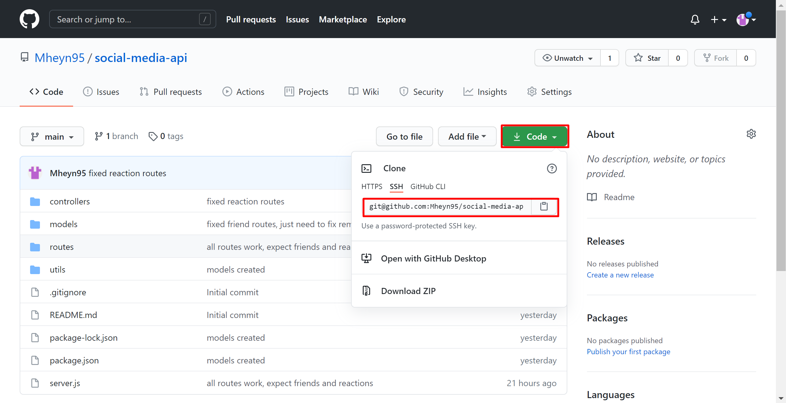
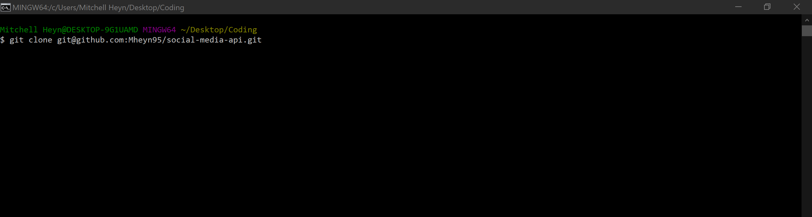

# Social Media Back-End

## License

## Description

This application can be used to generate a NoSQL database for a social media back end, and interact with it through an API.

## Table of Contents

- [Installation](#installation)
- [Usage](#usage)
- [Questions](#questions)
- [License](#license)
- [Credits](#credits)

## Installation

To install this file navigate to [https://github.com/Mheyn95/https://github.com/Mheyn95/social-media-api](https://github.com/Mheyn95/https://github.com/Mheyn95/social-media-api) in a web browser and clone the repository.

Here is an image of GitHub and where you can go to clone the repo.

Here is an image of the command you run in terminal to clone the repo onto your own local machine.

## Usage

Before you can use this application you will need to have MongoDB installed on your local machine.

To use this application go to the directory where you cloned the repository in the terminal. Once here you can run `npm i express mongoose` which will install the libraries needed for this app. Once you do that you can use Insomnia Core or any other application to test the API's on the backend.

To watch a video of how to run this application follow this link:
[Video of Social Media Back-End](https://drive.google.com/file/d/18y68Ee1L-CTjnVWoBK77Mshv3mS5uEmp/view)

## Questions

- GitHub - [https://github.com/Mheyn95](https://github.com/Mheyn95)
- Email - [mheyn95@gmail.com](mailto:mheyn95@gmail.com)

## Contributing

Mitchell Heyn
